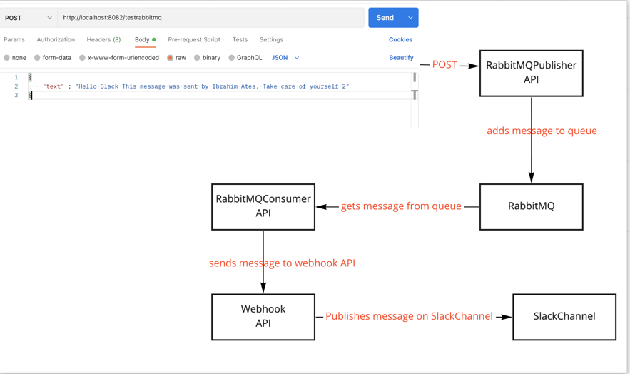

This app listens to the RabbitMQ queue and If the message comes from the queue it sends it to webhook API to send the slack channel.

When the queue publishes message the app is getting that message from queue and then writes to the console.

Before running this app please make sure rabbitMQ is running on your local. If rabbitMQ is not running on your machine, the app won't run.

And please create a new queue on your local rabbitMQ whose name should testrabbitmq

Webhook application is here > https://github.com/atesibrahim/webhookdemo

Flow as follows;

