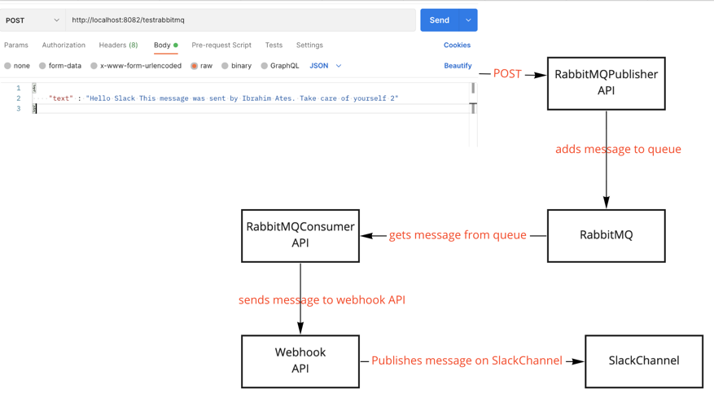

This app is a Restful API applicaiton. And It adds message to RabbitMQ queue.

When you post message to this app, then it will add message to queue.

Before running this app please make sure rabbitMQ is running on your local. If rabbitMQ is not running on your machine, the app won't run.

And please create a new queue on your local rabbitMQ whose name should testrabbitmq

Sample request;

POST: http://localhost:8082/testrabbitmq

Body:

Message {
"text" : "Hello Slack This message was sent by Ibrahim Ates. Take care of yourself"
}

Whole applications flow as follows;

